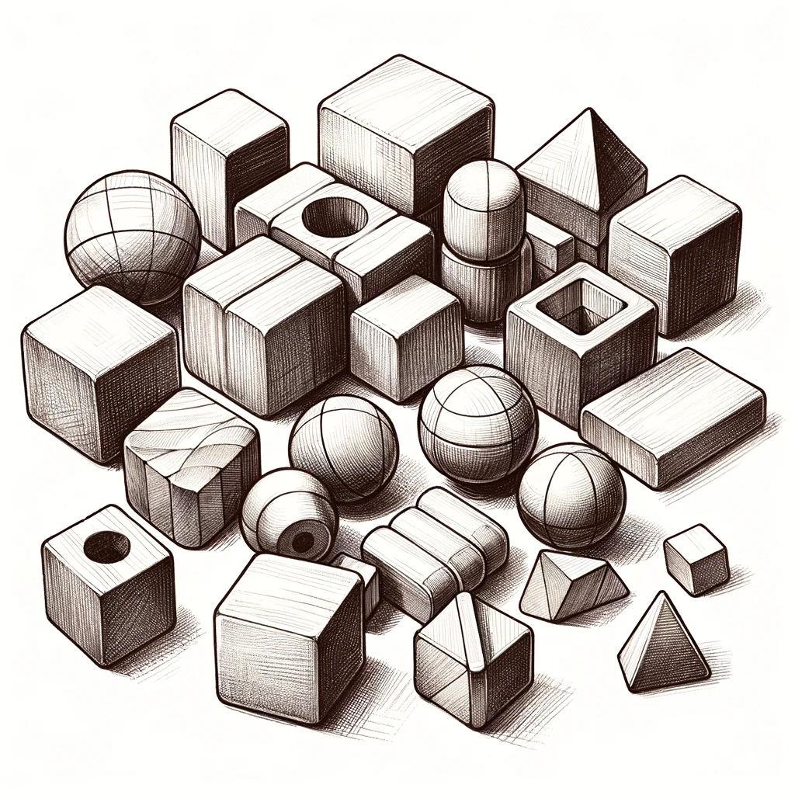

<h1 class="page-title">Maker Lab 3: School lab</h1>

**STEAM Teaching & Learning ESM 503, Fall 2026**

**Key words:** STEAM, Maker Lab, Constructionism, 3D printing, laser cutting, LEGO robotics, microbit, arduino

Description
-----------

In the “school lab” students are challenged to conceive of and design their own STEAM 
workshop, which they co-teach for the public as a workshop at the MIXI lab during our 
STEAM mini conference. To create their workshop, they will practice backwards 
design to develop and execute an effective lesson, including assessments of learning. 
Developing a specialized workshop allows students to solidify expert-level mastery of 
specific aspects of the maker lab; teaching these skills to an authentic audience helps 
them reflect on the knowledge they’ve acquired in the previous labs while practicing the 
lab-based pedagogical techniques which they’ve previously experienced as students.

Course Goals
------------

The student will be able to:

- Define and identify characteristics of equitable classrooms where all learners have access to ensuring
  academic achievement.
- Analyze multiple frameworks used to support the development, implementation, and assessment of
  effective STEAM curricula.
- Identify and practice different models of co-teaching to support teaching and learning.
- Reflect and critique one own’s planning, instruction and assessment plans implemented for
  continual improvement to ensure an equitable and effective STEAM classroom.

<h2 class="no-clear">Class Information</h2>
**Instructor:**

- [Matthew X. Curinga](https://matt.curinga.com) [<mcuringa@adelphi.edu>]
- Office Hours:
  - Wednesday, 3pm-5pm
  - Thursday 3:30pm-5:30pm
  - Online: _by appointment_

Meetings:

- Wednesday, 5pm-7pm and asynchronous online
- STEAM Lab, [Adelphi Manhattan Campus](https://maps.app.goo.gl/2ckow8RVobnkLHGfA), 3rd Floor, Room 311
- in person meetings:
  - September: 2, 16, 30
  - October: 14, 28
  - November: 11
  - December: 9, 17 (mini conference)

Required Textbook
-----------------
There are no required textbooks for this course. Students should
[opt out of the Panther eBundle Course Materials program](https://www.adelphi.edu/one-stop/billing-and-payment/opt-out-programs/).

Class Schedule
--------------

| Module | Date       | Topic                                                 
|--------|------------|-------------------------------------------------------
| 1      | Sep 03     | Robotics, Creativity, & Roots of Maker Education      
| 2      | Sep 17     | STEAM Teaching
| 3      | Sep 30     | Design Thinking
| 4      | Oct 14     | Pitches
| 5      | Oct 28     | Studio/Materials list
| 6      | Noc 11     | Workshop Critique
| 7      | Dec 09     | Rehearsal
| **8**  | **Dec 17** | **Conference**                                        

This course is organized into 8 2-week modules. Each module consists of an in-person
meeting in the Maker Lab and an online week.

**Everyone must meet for a final public conference on Monday December 17.**

This is a hybrid course with some in-person meetings and some online meetings. Mostly, we will
meet in-person every other week, but see the schedule above for details. Online weeks will be
oriented around completing course readings and working independently or in teams on assignments.
_There will not be synchronous Zoom meetings for online weeks._

In-person classes will feature discussions of course readings, group working sessions, and
maker lab activities. Towards the end of the term we will focus on developing your STEAM
workshops.

_You **must** complete the readings for the current module before our in-person meeting._

Sessions
--------


### Module 1, Sep 03

_Read:_

- Papert, S. (1999, March 29). [Child Psychologist Jean Piaget](https://content.time.com/time/subscriber/article/0,33009,990617,00.html). _Time_. 
- (optional) Valente, J. A., & Blikstein, P. (2019). [Maker Education: Where Is the Knowledge Construction?](https://tltlab.org/wp-content/uploads/2019/10/2019.Valente-Blikstein.Constructivist-Foundations.Maker-Education.pdf) _Constructivist Foundations_, _14_(3), Article 3.
- (optional) Resnick, M., Ocko, S., & Papert, S. (1988). [Lego, Logo, and Design](http://dailypapert.com/wp-content/uploads/2021/03/LEGO-Logo.-and-Design-Resnick-Ocko-Papert.pdf). _Children’s Environments Quarterly_, _5_(4), 14–18.
- Nickolaus Hines. (2022, October 10). [10 Brilliant Rube Goldberg Machine Examples](https://coolmaterial.com/feature/rube-goldberg-machines/). _Cool Material_. (check out some of the videos in preparation for our lab)

#### Module 2, Sep 17
_Read:_

- Needles, T. (2025). Part 1: STEAM Fundamentals, In, _Steam power: Infusing art into your stem curriculum_. International Society for Technology in Education. [[Adelpi Library link](https://ebookcentral.proquest.com/lib/adelphi/detail.action?docID=32128117)]
- Gerstein, J. (2019). Chapter 8: Integrating Maker Experiences into the Curriculum. In _Learning in the making : How to plan, execute, and assess powerful makerspace lessons._ Association for Supervision & Curriculum Development. [[Adelphi Library link](https://ebookcentral.proquest.com/lib/adelphi/reader.action?docID=5879638&ppg=86&c=UERG)]

#### Module 3, Sep 30
_Read:_
- Bosch, N., Härkki, T., & Seitamaa-Hakkarainen, P. (2025). [Teachers as reflective learning experience designers: Bringing design thinking into school-based design and maker education.](https://www.sciencedirect.com/science/article/pii/S2212868924000643) _International Journal of Child-Computer Interaction_, _43_, 100695. <https://doi.org/10.1016/j.ijcci.2024.100695>

_Do:_

Come to class prepared with your topic presentation. 
You will have exactly 5 minutes to present your topic. See assignment details below.

#### Module 4, Oct 14
_Do:_

Come to class prepared to pitch your workshop. Everyone presents your their own pitch (5 minutes + Q&A).



#### Module 5, Oct 28
This will be a full studio session. You and your partner _must_ come to the session
with a plan for your workshop. You should use the studio time to test out materials
and techniques (e.g. what settings do you need for the laser cutter? is there a sensor that you can
use for your micro:bit project?). If there are things you _know_ you will need for this session,
let the instructors know and we will try to pick it up.

At the end of the studio, you need to create a full material list including quantities, costs, and links.
Materials that are hard to find or require extra time will be purchased now.

#### Module 6, Nov 11
In this session you present your full workshop plan and receive feedback from the class and instructors.
During studio time you will incorporate feedback and update your workshop plan and materials list. Materials
will be sent for purchasing at this time.

#### Module 7, Dec 09
You will present the core of your workshop and participate in other workshops. We will
create a schedule where several teams are presenting at the same time. As a participant,
you will give thoughtful feed back to the presenters. Plan for a 30 minute version of your workshop.
In terms of supplies, if they are limited or expensive, you can have the entire group work on
one set of materials.

At the end of this session you will submit the final title and abstract for your workshop.

#### STEAM Mini Conference, Dec 17
**You absolutely cannot be late or miss this session. If you need special permission or to make
plans, do it now.**

The conference will have two simultaneous workshop sessions where participants choose which workshop to attend.
While you are presenting, you will not be able to attend other sessions. When you are not presenting, you must
attend one workshop. Come early to get set up your room (we can't all be in the maker lab) and gather
materials.



Grading & Assignments
---------------------



| Assignment	                |Points
|-----------------------------|-------
| Participation & Attendance	|15
| Topic presentation          |15
| Pitch	                      |15
| Critique	                  |15
| Demo	                      |15
| Final Presentation	        |25

### Submitting portfolio assignments

Everyone should have an online portfolio that they began
in _Maker 1: Design Lab_. If you do not, you can create a new
one in Google Sites. See assignment details for what you
should submit in your portfolio.

### Participation & attendance

One of the tenets of this class is that learning is more vibrant when we work on it together.
Collectively, we will work to develop new understandings of the potential and challenges
of maker education. In our labs, we will work to design and test new curricular projects.
_This cannot happen if you do not attend class, are not prepared, or arrive late._

You will be given two participation grades, and each time it will be the average
of the instructor's assessment and your self-assessment. The self-assessment is
straightforward, you will assign a numeric grade (0-15 for participation 1, 0-10 for participation 2)
and a brief statement explaining your criteria. Your criteria will not exactly match
my criteria, as we all value different aspects of learning. Here are the things I
am looking for:

- **Preparation:** You have completed the assigned readings and are ready to discuss them.
- **Respect:** You are actively engaged in the class discussion and activities, including
  listening to others and sharing your own ideas. In team projects, you respect deadlines
  and meeting times, and don't add to the stress and workload of your teammates.
- **Risk taking:** In some ways, deep learning is always uncomfortable. Full participation
  means you are willing to take risks and make mistakes. It also means that you go beyond
  the minimum requirements and shared materials to help us push boundaries together.
  You will approach projects with an open mind and try to recognize your own
  biases and preconceptions.
- **Attendance is required for all in person classes**. The only excused absences
  are in keeping with the University's policy: illness or other documented emergency.
- **Work/school obligations are not an excuse for absence or lateness.** This
  includes any coaching, club, professional development, proctoring, or other
  obligations.
- **Attendance grading:**
  - for each lateness less than 10 minutes you will lose 1 point on your final grade
  - for each absence or lateness more than 10 minutes you will lose 2 points on your final grade
  - if you miss more than 3 of the total 8 in person classes, you may be asked to withdraw
    and repeat this course
  - The final "mini conference" on Tuesday May 13 is absolutely mandatory.
    Please make any arrangements necessary to be present for this meeting.




### Topic Presentation
Before you start designing your workshop, you will identify the area that you want
to focus on. This will include specific content area, specific STEAM/maker techniques,
and the specific audience. You will create a 5 minute presentation for class where you
cover:

1. why this topic matters
2. a quick summary of scholarly research around teaching this area
3. STEAM/maker techniques you think are a good fit for teaching
4. best practices for those techniques (either from scholarship or professional publications)
5. a biography and list of resources

_Post your presentation in your portfolio._

### STEAM Workshop
The major outcome of this studio course is the professional
development STEAM workshop that you create with your partner.
This will be developed in several stages:

1. **Pitch:** everyone pitches their own workshop idea. Only after
   your pitch is approved by the instructors can it be considered
   for a final workshop.
2. **Critique:** you and your partner will present a more fleshed out
   concept for a workshop to the class and instructors for feedback.
   You will demonstrate/prototype core aspects of the lesson.
3. **Demo:** you and your partner will do a 15 minute demonstration of your workshop
   prior to the public conference. All materials and procedures should be
   ready for this demo. You will be able to fine-tune your workshop after
   the demo.
4. **Public presentation:** you present your workshop at the STEAM mini-confernce
   to an audience of peers, faculty, professional colleagues, and NYC high school
   guests.

The course culminates in a public mini-conference where you will lead
a 60 minute workshop. Workshops will be co-taught (2 per team). If we have an odd number
of participants, **one group** can have 3 people, or one person can present alone. There
will be no other teams of 3 or 1.

The audience for the conference will
be STEM teachers (your peers and others like you), Adelphi faculty and staff,
MIXI alums, students in the PhD in Learning Sciences, grad students from other universities, 
and high school students invited to attend.

**Workshop requirements:**

- demonstrate a deep knowledge of one of the techniques of the maker lab and steam education
- address a hard pedagogical problem, related to your academic subject 
  (i.e. aligns with standards and goals of the field) Explicitly identify where this workshop could "fit" in the grades 7-12 curriculum 
- design a workshop that is engaging and effective at meeting your goals 
- organize and present an effective session applying the principles of learning 

<a class="d-block btn btn-primary btn-block fs-3" href="/courses/maker2/conference-2024.html">
See the 2024 STEAM Mini Conference Program</a>



 

#### Workshop Pitch
Although this is a pair project, everyone will design their
own workshop pitch. The pitch will be a 5 minute presentation
where you share your idea for a great workshop. After hearing
and discussing all of the pitches, we will form teams of 2.

For the pitch, focus on:

- why your idea is innovative and creative
- the hard problem it addresses in your field
- where this type of learning could take place in your curriculum (be specific)
- that it is feasible and good match for your skills, our facilities, and the time/budget restrictions

**In your portfolio:**

- write a brief (300 word) pitch for your workshop
- link or embed any presentations materials you created
- reflect on the pitch based on feedback from the class/instructors

#### Critique
For the critique, your team will present the first draft of your lesson. This will not be
the full 60 minute session, but you will walk us through the key aspects of your workshop.
For items that are not ready (because they need to be built or ordered), we can role play
and use low fidelity prototypes.

**In your portfolio:** (after the critique)

- submit a revised plan for your workshop
- a complete list of materials
  - indicate what you will be using that is on-hand in the lab
  - a list of materials to order with the quantity, cost, and link to where to purchase
  - a total budget for materials

#### Demo
The demo is a rehearsal for your live presentation. You must have
all materials prepared and ready. You will lead the demo the
same as you will the live conference presentation.

**In your portfolio:** (after the demo)

- final lesson plan for the workshop
- final workshop title and abstract
- reflection on changes/refinements and outstanding items
- photos/videos/artifacts documenting your demo workshop

#### Workshop
You will present your workshop and be observed by course
instructors and other Adelphi faculty, school partners, K12 students,
Fordham doctoral students and other guests who attend. In addition
to the quality of your lesson and the materials your produce,
we are evaluating you on the effectiveness of your presentation
and ability to perform as an instructional leader and coach.

