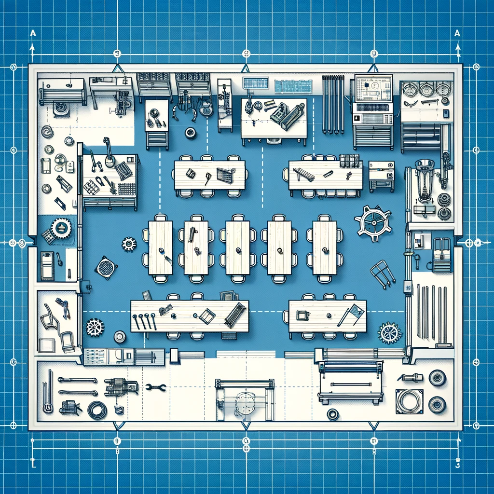
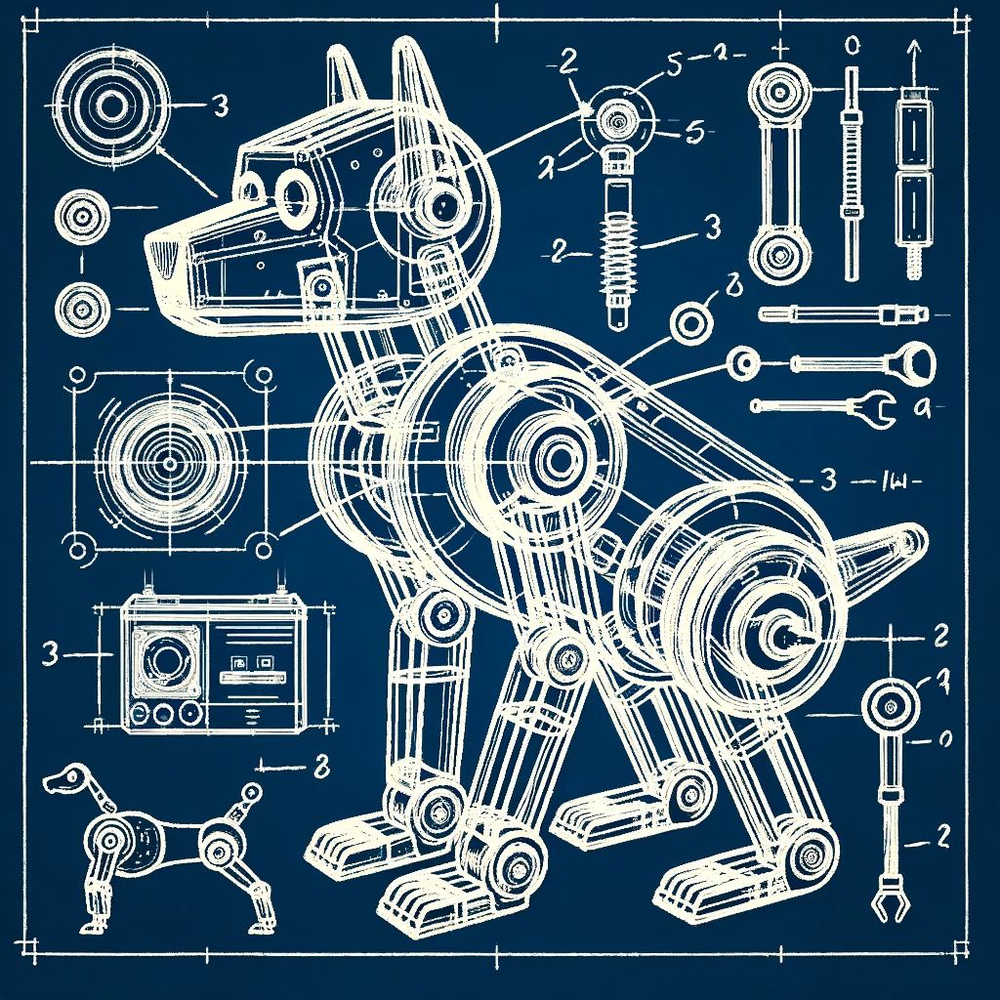
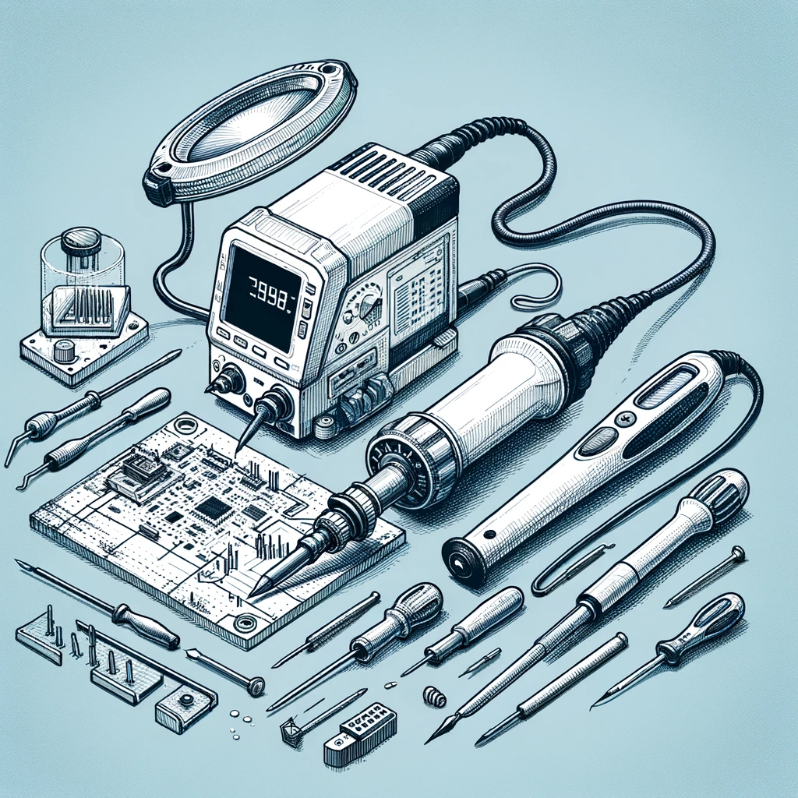
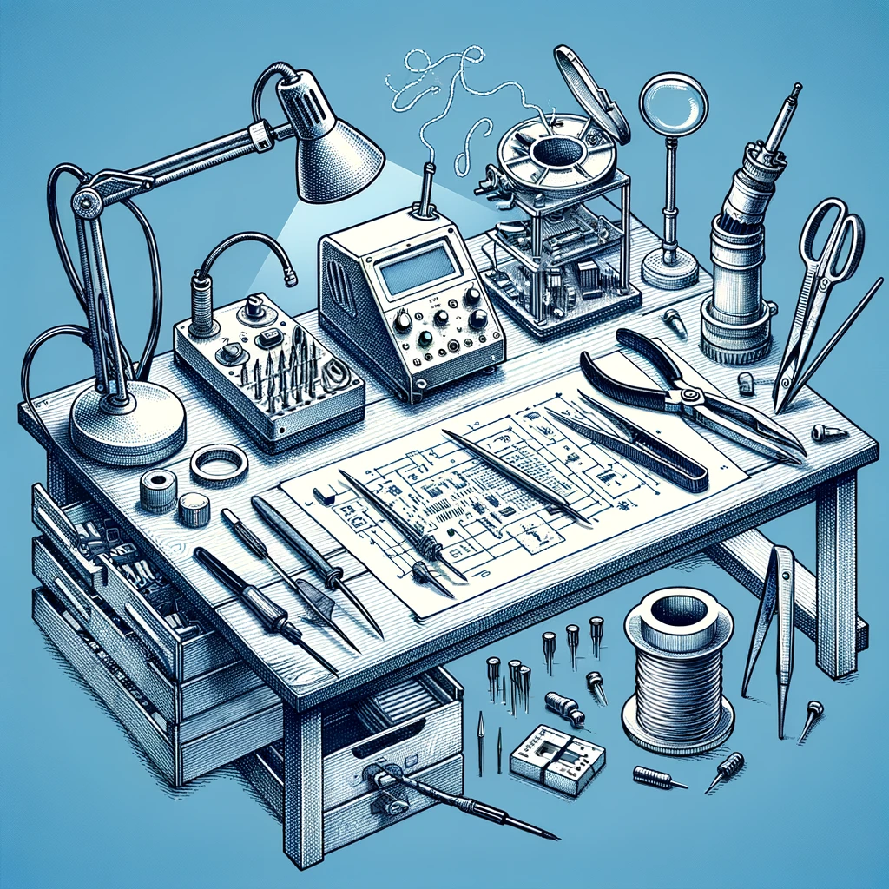

<h1 class="page-title">Maker Lab 3: School lab</h1>

**STEAM Teaching & Learning ESM 503, Spring 2024**

**Key words:** STEAM, Maker Lab, Constructionism, 3D printing, laser cutting, LEGO robotics, microbit, arduino

Description
-----------

In the “school lab” students are challenged to conceive of and design their own STEAM 
workshop, which they co-teach for the public as a workshop at the MIXI lab during our 
Spring STEAM mini conference. To create their workshop, they will practice backwards 
design to develop and execute an effective lesson, including assessments of learning. 
Developing a specialized workshop allows students to solidify expert-level mastery of 
specific aspects of the maker lab; teaching these skills to an authentic audience helps 
them reflect on the knowledge they’ve acquired in the previous labs while practicing the 
lab-based pedagogical techniques which they’ve previously experienced as students. 
[prerequisite: maker labs 1 & 2]. 25 hours of fieldwork is required.

Course Goals
------------

The student will be able to:

- Define and identify characteristics of equitable classrooms where all learners have access to ensuring
  academic achievement.
- Analyze multiple frameworks used to support the development, implementation, and assessment of
  effective STEAM curricula.
- Identify and practice different models of co-teaching to support teaching and learning.
- Reflect and critique one own’s planning, instruction and assessment plans implemented for
  continual improvement to ensure an equitable and effective STEAM classroom.

<h2 class="no-clear">Class Information</h2>
**Instructor:**

- [Matthew X. Curinga](http://matt.curinga.com), <mcuringa@adelphi.edu>
- [Tracy Hogan](hogan@adelphi.edu)

**Class dates:** Tuesday January 23 - Tuesday May 15

**Office hours:**

- Tuesday 3pm-5pm, Brooklyn Campus
- _office hours by appointment_

Required Textbook
-----------------
_There is no required textbook for this course. Course readings will be made available through the course website._

Class Schedule
--------------

| Module | Date    | Topic                                                 | Section 1 | Section 2 |
|--------|---------|-------------------------------------------------------|-----------|-----------|
| 1      | Jan 28  | Robotics, Creativity, & Roots of Maker Education      | Jan 28    | Feb 4     |
| 2      | Feb 11  | Mushrooms and Deconstructing Instructional Frameworks | Feb 11    | Feb 18    |
| 3      | Feb 25  | Workshop Brainstorming                                | Feb 25    | Mar 4     |
| 4      | Mar 11  | Pitch                                                 | Mar 11    | Mar 18    |
| 5      | Mar 25  | Workshop Critique                                     | Mar 25    | Apr 1     |
| 6      | Apr 8   | Studio Session                                        | Apr 8     | Apr 15    |
| 7      | Apr 29  | Workshop Rehearsal                                    | Apr 29    | May 6     |
| 8      | May 13  | Conference                                            | **May 13**| **May 13**|

This course is organized into 8 2-week modules. Each module consists of an in-person
meeting in the Maker Lab and an online week. If you are in **section 001** you will
meet in person for the section 1 dates, above. Likewise for **section 002**.

**Everyone will meet for a final public conference on May 13.**

This is a hybrid course with some in-person meetings and some online meetings. Mostly, we will
meet in-person every other week, but see the schedule above for details. Online weeks will be
oriented around completing course readings and working independently or in teams on assignments.
There will not be synchronous Zoom meetings for online weeks.

In-person classes will feature discussions of course readings, group working sessions, and
maker lab activities. Towards the end of the term we will focus on developing your STEAM
workshops. 

_You **must** complete the readings for the current module before your the in-person meeting for your section._

<section class="ClassMeetings p-2 rounded border">
<h2>Class Meetings</h2>



### Module 1: Roots & Robots (Jan 28 - Feb 4)
In our first 2 weeks we will read and talk about the roots
of maker and STEAM education, and reflect on the goals
of maker ed while advancing our own skills in with the
tools of the maker lab using LEGO Robotics. Mindstorm
robots are the direct descendent of Seymour Papert's
groundbreaking Constructionist research at MIT, beginning
with the LOGO programming language and LOGO Turtle.

_Seymour Papert presenting his LOGO Turtle robot [via Wikimedia](https://commons.wikimedia.org/wiki/File:Seymour_Papert.jpg)_

#### Readings (before class)
- Papert, S. (1999, March 29). [Child Psychologist Jean Piaget](https://content.time.com/time/subscriber/article/0,33009,990617,00.html). _Time_. 
- Valente, J. A., & Blikstein, P. (2019). [Maker Education: Where Is the Knowledge Construction?](https://tltlab.org/wp-content/uploads/2019/10/2019.Valente-Blikstein.Constructivist-Foundations.Maker-Education.pdf) _Constructivist Foundations_, _14_(3), Article 3.
- (optional) Nickolaus Hines. (2022, October 10). [10 Brilliant Rube Goldberg Machine Examples](https://coolmaterial.com/feature/rube-goldberg-machines/). _Cool Material_. (check out some of the videos in preparation for our lab)

#### Agenda
1. Introductions
2. About the School Lab
3. Discuss Readings
4. Rube Goldberg LEGO Lab [[details](/courses/maker3/rube.html)]
5. Lab Demo

### Module 2: Mushrooms and Deconstructing Instructional Frameworks (Feb 11 - Feb 18)
In this session we will discuss how to design
lessons for professional development and how
to become a leader in your school. We will complete
a lab that explores biological rather than mechanical/digital
making.

_[Mycelium Art from Musée Magazine](https://museemagazine.com/features/2020/3/4/mycelium-microcosm-mushrooms-link-science-with-art)_

#### Readings due
- Martinez, S. L., & Stager, G. (2019). [Teaching (Chapter 5)](https://drive.google.com/file/d/1xIwfkHnIx48D8hmxivhMrhiMswwHpxnt/view?usp=drive_link) in _Invent to learn: Making, tinkering, and engineering in the classroom_. Constructing Modern Knowledge Press. 
- Loeng, S. (2023). Pedagogy and andragogy in comparison – Conceptions and perspectives. Andragoška spoznanja/Studies in _Adult Education and Learning_, _1_(1-14). <https://doi.org/10.4312/as/11482>
- Birman, B. F., Desimone, L., Porter, A. C., & Garet, M. S. (2000). Designing professional development that works. _Educational Leadership_, _57_(8), 28-33

#### Agenda
1. [Deconstructing a TedTalk](https://www.youtube.com/watch?v=OcdumFcGdfU) What Makes a TedTalk so Inviting? 
2. Reading Discussion and synthesizing an instructional framework for adult learning
3. Sign up for article presentations
4. Lab Demo: [Grow Bio](https://grow.bio/?srsltid=AfmBOoqAcFSiEUDCceDfpy1SfSDfiptP0QkJcme2szLZ_v6daezMA4Fi)

### Module 3: Play, Creativity, & Workshop Brainstorming (Feb 25 - March 4)
The success of this course depends on each
class member developing new skills, and iterating
many times over their workshop ideas until they are
polished enough for a public demonstration.
The readings for this session focus on creativity
and play, and we will actively work on exercising
our own creativity and work to design playful learning
experiences.
In this session we will think about the creative process, 
help set our own learning goals for the semester, and get 
ready to make a pitch for an extraordinary workshop.

#### Readings due
- Gallup. (2020). Creativity in learning: Understand the value of creativity in learning and how to enable it in the classroom by leveraging the full potential of technology. Gallup. Retrieved from https://www.gallup.com
- Blikstein, P., & Worsley, M. (2016). Children are not hackers. In K. Peppler, E. Halverson, & Y. B. Kafai (Eds.), _Makeology: Makerspaces as Learning Environments_. Routledge.
- Wilson, H. E., Song, H., Johnson, J., Presley, L., & Olson, K. (2021). [Effects of transdisciplinary STEAM lessons on student critical and creative thinking.](https://www-tandfonline-com.adelphi.idm.oclc.org/doi/pdf/10.1080/00220671.2021.1975090?needAccess=true)
  _The Journal of Educational Research_, _114_(5), 445–457.

### Module 4: STEAM & School Culture, Pitches (Feb 11 - Feb 24)

In this module we discuss how STEAM and Maker Education fits in with 
movements to change and advance school-based learning. In addition, 
we will hear formal pitches from everyone for their final workshop (see details below).

#### Readings due
- Papert, S. (1997). [Why School Reform is Impossible](https://www-jstor-org.adelphi.idm.oclc.org/stable/1466781?seq=1). 
  _The Journal of the Learning Sciences_, _6_(4), 417–427.
- Godhe, A.-L., Lilja, P., & Selwyn, N. (2019). [Making sense of making: Critical issues in the integration of maker education into schools](https://drive.google.com/file/d/1v4_yeGCerrOu-oL4ZydppUhtZ5RoVzU2/view?usp=drive_link). 
  _Technology, Pedagogy and Education_, _28_(3), 317–328.
- Bullock, E. (2017). [Only STEM Can Save Us? Examining Race, Place, and STEM Education as Property](https://drive.google.com/file/d/1rPO60csvMHJZV_LuNu5kvJqP380-0LJJ/view?usp=sharing).
  _Educational Studies_, _53_(6), 628–641.

#### Agenda
- Reading Discussion
- Pitches

### Module 5: Workshop Critique (March 25 - April 1)
In this session pairs will present their proposed
workshop and run a demo of the core component(s).
They will receive feedback from the class and instructors.

After considering this feedback, the final draft of their
workshop as well as their material list and budget are due.

#### Readings due
- Student readings 1 (TBD)

### Module 7: Workshop Rehearsal (April 29 - May 6)
This is the final run through of the demo. Each
team will run their workshop for a group of students
and instructors. All materials must be 100% ready
for this demo. Teams will have the opportunity to
refine their workshop based on the experience.





### Module 6: Workshop Studio (Mar 11 - Mar 18)
This will be a full lab, working session to prepare materials
and methods for the full rehearsal and final show.

#### Readings due
- [student readings 2]

#### Agenda
1. Reading Discussion
2. Lab work on workshops

### Module 8: Mini-Conference May 13
The mini-conference will be held on
the 7th floor of Adelphi-St. Francis, from 5pm-8pm.
Students from both sections must attend on May 13. You should
plan to be on campus by 4:30 on May 13 in order
to prepare your materials.

- schedule (TBD)
- friends, family, and colleagues welcome (sign-up TBD)



</section>

Grading & Assignments
---------------------



| Assignment	                |Points
|-----------------------------|-------
| Participation & Attendance	|15
| Article presentation	      |15
| Pitch	                      |15
| Critique	                  |15
| Demo	                      |15
| Final Presentation	        |25

### Submitting portfolio assignments

Everyone should have an online portfolio that they began
in _Maker 1: Design Lab_. If you do not, you can create a new
one in Google Sites. See assignment details for what you
should submit in your portfolio.

### Participation & attendance

One of the tenets of this class is that learning is more vibrant when we work on it together.
Collectively, we will work to develop new understandings of the potential and challenges
of maker education. In our labs, we will work to design and test new curricular projects.
_This cannot happen if you do not attend class, are not prepared, or arrive late._

You will be given two participation grades, and each time it will be the average
of the instructor's assessment and your self-assessment. The self-assessment is
straightforward, you will assign a numeric grade (0-15 for participation 1, 0-10 for participation 2)
and a brief statement explaining your criteria. Your criteria will not exactly match
my criteria, as we all value different aspects of learning. Here are the things I
am looking for:

- **Preparation:** You have completed the assigned readings and are ready to discuss them.
- **Respect:** You are actively engaged in the class discussion and activities, including
  listening to others and sharing your own ideas. In team projects, you respect deadlines
  and meeting times, and don't add to the stress and workload of your teammates.
- **Risk taking:** In some ways, deep learning is always uncomfortable. Full participation
  means you are willing to take risks and make mistakes. It also means that you go beyond
  the minimum requirements and shared materials to help us push boundaries together.
  You will approach projects with an open mind and try to recognize your own
  biases and preconceptions.
- **Attendance is required for all in person classes**. The only excused absences
  are in keeping with the University's policy: illness or other documented emergency.
- **Work/school obligations are not an excuse for absence or lateness.** This
  includes any coaching, club, professional development, proctoring, or other
  obligations.
- **Attendance grading:**
  - for each lateness less than 10 minutes you will lose 1 point on your final grade
  - for each absence or lateness more than 10 minutes you will lose 2 points on your final grade
  - if you miss more than 3 of the total 8 in person classes, you may be asked to withdraw
    and repeat this course
  - The final "mini conference" on Tuesday May 13 is absolutely mandatory.
    Please make any arrangements necessary to be present for this meeting.



### Article Presentation
The first four modules have instructor assigned readings. The next 3 modules will have
student assigned readings. Working with a partner, you will choose an academic article
related to our course topics and assign it for reading. Your team will be responsible
for leading a discussion on the article your assigned. You will be graded on a 
**portfolio entry** where you indicate the following:

- why you chose the article and its relevance
- a summary of the article and discussion of how it related to the course
- notes/questions for leading the discussion
- a reflection on the article and discussion to the class
- _each team member will complete the portfolio portion independently_



### STEAM Workshop
The major outcome of this studio course is the professional
development STEAM workshop that you create with your partner.
This will be developed in several stages:

1. **Pitch:** everyone pitches their own workshop idea. Only after
   your pitch is approved by the instructors can it be considered
   for a final workshop.
2. **Critique:** you and your partner will present a more fleshed out
   concept for a workshop to the class and instructors for feedback.
   You will demonstrate/prototype core aspects of the lesson.
3. **Demo:** you and your partner will do a full demonstration of your workshop
   prior to the public conference. All materials and procedures should be
   ready for this demo. You will be able to fine-tune your workshop after
   the demo.
4. **Public presentation:** you present your workshop at the STEAM mini-confernce
   to an audience of peers, faculty, professional colleagues, and NYC high school
   guests.

The course culminates in a public mini-conference where you will lead
a 45 minute workshop with one teammate. The audience for the conference will
be STEM teachers (your peers and others like you), Adelphi faculty and staff,
MIXI alums, friends from the doctoral program in education at Fordham University, 
and high school students invited to attend.

**Workshop requirements:**

- demonstrate a deep knowledge of one of the techniques of the maker lab and steam education
- address a hard pedagogical problem, related to your academic subject 
  (i.e. aligns with standards and goals of the field)
- design a workshop that is engaging and effective at meeting your goals
- organize and present an effective session

<a class="d-block btn btn-primary btn-block fs-3" href="/courses/maker2/conference-2024.html">
See the 2024 STEAM Mini Conference Program</a>



 

#### Workshop Pitch
Although this is a pair project, everyone will design their
own workshop pitch. The pitch will be a 5 minute presentation
where you share your idea for a great workshop. After hearing
and discussing all of the pitches, we will form teams of 2.

For the pitch, focus on:

- why your idea is innovative and creative
- the hard problem it addresses in your field
- that it is feasible and good match for your skills, our facilities, and the time/budget restrictions

**In your portfolio:**

- write a brief (300 word) pitch for your workshop
- link or embed any presentations materials you created
- reflect on the pitch based on feedback from the class/instructors

#### Critique
For the critique, your team will present the first draft of your lesson. This will not be
the full 45 minute session, but you will walk us through the key aspects of your workshop.
For items that are not ready (because they need to be built or ordered), we can role play
and use low fidelity prototypes.

**In your portfolio:** (after the critique)

- submit a revised plan for your workshop
- a complete list of materials
  - indicate what you will be using that is on-hand in the lab
  - a list of materials to order with the quantity, cost, and link to where to purchase
  - a total budget for materials

#### Demo
The demo is a rehearsal for your live presentation. You must have
all materials prepared and ready. You will lead the demo the
same as you will the live conference presentation.

**In your portfolio:** (after the demo)

- final lesson plan for the workshop
- final workshop title and abstract
- reflection on changes/refinements and outstanding items
- photos/videos/artifacts documenting your demo workshop

#### Workshop
You will present your workshop and be observed by course
instructors and other Adelphi faculty who attend. In addition
to the quality of your lesson and the materials your produce,
we are evaluating you on the effectiveness of your presentation
and ability to perform as an instructional leader and coach.
