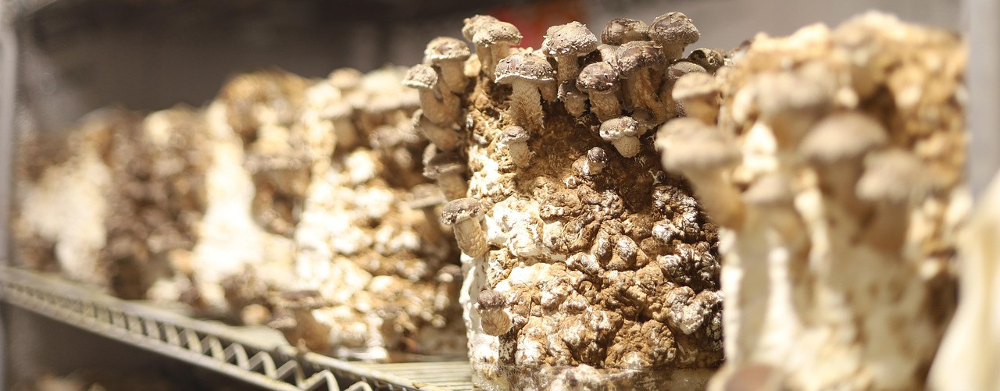

Mycelium Lab
==========================
[back to syllabus](/courses/maker3)

<!-- add images to /content/courses/maker3/img folder -->

Overview
--------
"Rube Goldberg Machines" have been tried and true (maybe stale?)
hands-on projects in K-12 science classrooms; a way to teach
elements such as simple machines, design thinking, motion,
energy transfer, and more. In this lab, we will continue to
explore the potential of educational robotics by building
a Rube Goldberg machine with LEGO robotics mixed with other materials.
The focus of this lab is on creativity and originality. To constrain
the activity (and foster discussions between teams), each team
must build a system that ends by extinguishing a candle. Teams
will range in size from 2 people to 4 people depending on the
total number of participants. Each team will have a LEGO Prime
robotics kit and a laptop loaded with the LEGO Prime app,
connected to their robot. They will have access to the shared
materials, as well.

Time
----
60 minutes

Goals
-----
This lab is designed ...

- make art with mushrooms

Prior activities
----------------

Stock Materials
---------------
- birthday candles, matches / lighters

Procedure
---------

Timeline:
---------
1. start
2. middle
3. end

Resources
---------
- [Spike Prime Resources](https://education.lego.com/en-us/product-resources/spike-prime/downloads/building-instructions/)
