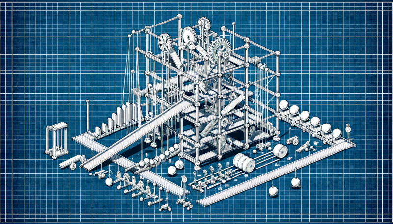
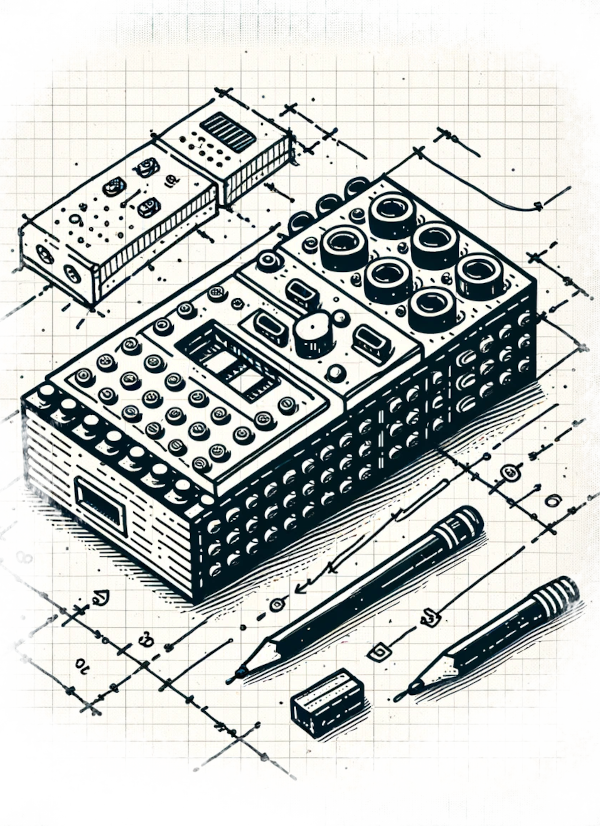

LEGO Robotics Catapult Lab
==========================
[back to syllabus](/courses/maker3)

Overview
--------
"Rube Goldberg Machines" have been tried and true (maybe stale?)
hands-on projects in K-12 science classrooms; a way to teach
elements such as simple machines, design thinking, motion,
energy transfer, and more. In this lab, we will continue to
explore the potential of educational robotics by building
a Rube Goldberg machine with LEGO robotics mixed with other materials.
The focus of this lab is on creativity and originality. To constrain
the activity (and foster discussions between teams), each team
must build a system that ends by extinguishing a candle. Teams
will range in size from 2 people to 4 people depending on the
total number of participants. Each team will have a LEGO Prime
robotics kit and a laptop loaded with the LEGO Prime app,
connected to their robot. They will have access to the shared
materials, as well.

Time
----
60 minutes

Goals
-----
This lab is designed as an exploration of
LEGO Robotics in the context of design, creativity,
play, and originality. Participants will:

- combine LEGO and non-LEGO materials to create a Rube Goldberg
  machine
- use at least 1 LEGO sensors and 1 LEGO motors
- program the motor and sensor
- design a system that "works" but is also fun and novel
- combine LEGO and non-LEGO parts
- each system must have at least 2 major components
- each team member must be the lead designer for at least one component

Prior activities
----------------
Before the lab, teams have been formed and members have been asked to review online
examples of rube goldberg machines.

Stock Materials
---------------
- birthday candles, matches / lighters
- LEGO Spike Prime robotics kits (1 kit per team)
- extra LEGO people, bricks / gears / axles / etc.
- crafting:
  - marbles, dominoes, magnets, coins
  - string, rubber bands, tape, pipe cleaners, glue
  - scissors, knives
  - cardboard, paper, felt, foam, plastic, wood
  - small cups, bowls, and containers
  - markers, paint, and other art supplies
- other electronics:
  - batteries, wires, switches, buzzers, LEDs
  - small motors, fans, and other moving parts
  - small microcontrollers (e.g., micro:bit, arduino)  
  - small speakers
  - breadboards, wires, resistors, capacitors, etc.
- equipment:
  - laser cutter
  - cricut
  - inkjet printer
  - glue guns

Procedure
---------
This is a largely unstructured activity. The teams will work to design a consistent
project that has a unified theme, and will sequence their components so
they work together and transition to one another. Each member will design
their own component, but teams are free to build them together, or just support
each other as they work on their own component.

Timeline:
---------
1. Introduction to building and programming LEGO prime (8 minutes)
2. Explanation of the challenge (2 minutes)
3. Teams work on project, instructors support with both ideas and using LEGO (35 minutes)
4. Teams demo their Rube Goldberg machine (15 minutes)

Resources
---------
- [Spike Prime Resources](https://education.lego.com/en-us/product-resources/spike-prime/downloads/building-instructions/)
