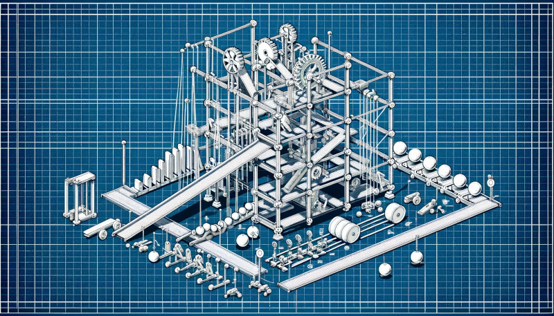
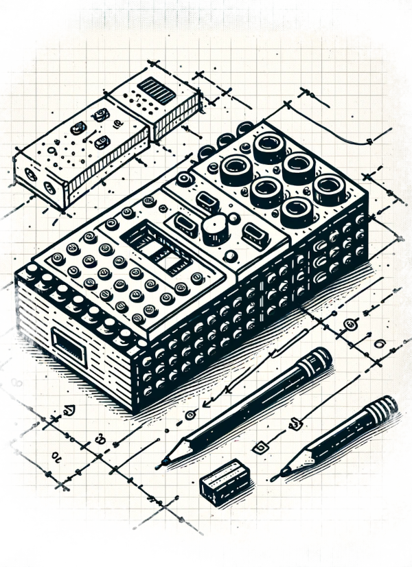

LEGO Robotics Rube Goldberg Lab
===============================
[back to syllabus](/courses/maker3)

Overview
--------
"Rube Goldberg Machines" have been tried and true (maybe stale?)
hands-on projects in K-12 science classrooms; a way to teach
elements such as simple machines, design thinking, motion,
energy transfer, and more. In this lab, we
explore the potential of educational robotics by building
a Rube Goldberg machine with LEGO robotics mixed with other materials.
The focus of this lab is on creativity and originality. To constrain
the activity (and foster discussions between teams), each team
must build a system that ends by extinguishing a candle. Teams
will range in size from 2 people to 4 people depending on the
total number of participants. Each team will have a LEGO Prime
robotics kit and a laptop loaded with the LEGO Prime app,
connected to their robot. They will have access to the shared
materials, as well.

Learning Goals
--------------

Students will reflect on the elements of curriculum design
which integrates play and creativity into a content-based lesson.
The lab teaches two things at once: students learn how to use
LEGO robotics, a common tool in maker and STEM classrooms, while
also deepening their understanding of maker and STEAM pedagogies.

_Students will:_

- uses LEGO motors, sensors, and gears to build simple machines
- understand robotics design as a combination of sensing the world,
  reacting to sensor data, and controlling mechanical systems through
  software
- uses event-based programming and parallelism to accomplish goals
- describe and critique the activity in terms of constructivist learning 
  and maker pedagogy

The Challenge
-------------

- **extinguish a birthday candle at the end of your machine's run**
- combine LEGO and non-LEGO materials to create a Rube Goldberg
  machine
- use at least 1 LEGO sensors and 1 LEGO motors
- program the motor and sensor
- design a system that "works" but is also fun and novel
- each system must have at least 2 major components
- add decorative designs that enhance the theme of your machine

Prior activities
----------------
Before the lab, teams have been formed and members have been asked to review 
online examples of rube goldberg machines, and given a general overview of LEGO 
Prime Spike.

Stock Materials
---------------
- birthday candles, matches / lighters
- LEGO Spike Prime robotics kits (1 kit per team)
- extra LEGO people, bricks / gears / axles / etc.
- crafting:
  - marbles, dominoes, magnets, coins
  - string, rubber bands, tape, pipe cleaners, glue
  - scissors, knives
  - cardboard, paper, felt, foam, plastic, wood
  - small cups, bowls, and containers
  - markers, paint, and other art supplies
- equipment:
  - laser cutter
  - cricut
  - inkjet printer
  - glue guns
  - 3D doodlers
  - vinyl cutter

  


Procedure
---------
After a brief introduction to the project and goals, students
will be given time to explore the LEGO kits. Each team
will have one LEGO Prime kit and one laptop configured
to program the "brick", which is already connected. Teams
will get as much help as needed from instructors, both on 
the technical aspects of using LEGO robots, and the design
of an interesting and creative Rube Goldberg machine. The
instructor will keep track of time and monitor to make
sure teams are making progress and can test their work
before the final demo at the end of the lab.

Timeline (60 minutes):
---------
1. Explanation of the challenge (3 minutes)
3. Teams work on project, instructors support with both ideas and using LEGO (40 minutes)
4. Teams demo their Rube Goldberg machine (15 minutes)

Resources
---------
- [Spike Prime Resources](https://education.lego.com/en-us/product-resources/spike-prime/downloads/building-instructions/)
- [NYC FIRST Robotics](https://www.nycfirst.org/)


  


Start!
======
1. Grab your LEGO Spike Prime kit and laptop.
2. Go to <https://spike.legoeducation.com/prime/project>:
   - Click "New Project"
   - Choose "Word Blocks"
3. Make sure you can push a simple program to your robot
4. Build and design your Rube Goldberg machine!

  

